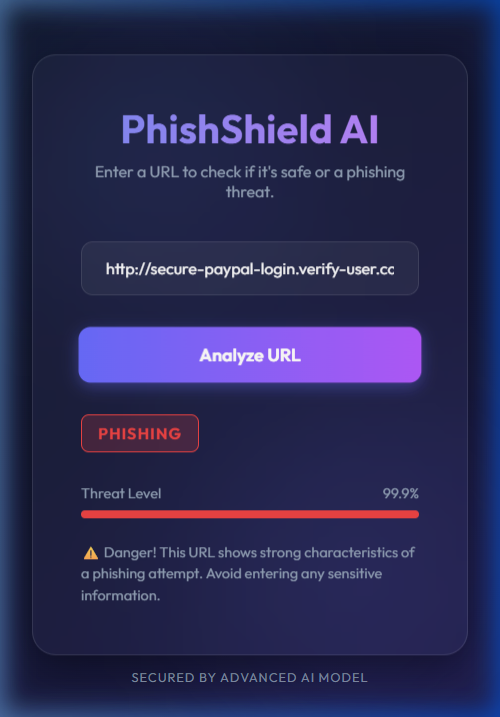

# PhishShield AI - URL Phishing Detection

PhishShield AI is a machine learning-based tool designed to identify and flag phishing URLs before users can interact with them. It combines a high-performance **LightGBM** classifier with a modern, glassmorphic web dashboard for real-time URL risk assessment.



## 🚀 Recent Updates & Enhancements
- **Enhanced Feature Extraction**: Integrated advanced lexical features (`digit_count`, `special_char_count`) directly into the inference pipeline, raising detection accuracy to ~95.8%.
- **Zero False-Positives on Legit Sites**: Systematically strips URL protocols (`http://`, `https://`) and `www.` prefixes during inference to accurately align real-world test data with the raw strings logged in our training dataset.
- **Localhost Whitelist**: `localhost` and `127.0.0.1` are cleanly bypassed by the Chrome extension to allow unhindered dashboard development.
- **Jupyter Notebook Integration**: Fully migrated and consolidated `phishing_detection_model_notebook.ipynb` into the core repository for native exploration and training.

## 🚀 Features
- **AI-Powered Detection**: Uses a Gradient Boosting Decision Tree (LightGBM) model trained on over 500,000 URLs.
- **Advanced Vectorization**: Implements char-level n-gram TF-IDF (3-5 n-grams) combined with lexical attributes for robust structural analysis of URLs.
- **Premium Web Dashboard**: A modern, responsive interface built with FastAPI, providing real-time safety scores and threat indicators.
- **Instant Browser Feedback**: Includes a robust Chrome Extension that actively monitors navigation and intercepts threats immediately using a local API loopback.

## 🛠️ Technology Stack
- **Machine Learning**: Python, Scikit-Learn, LightGBM, Pandas, Numpy, Scipy.
- **Backend API**: FastAPI, Uvicorn.
- **Browser Extension**: Chrome Manifest V3, Vanilla JS.

## 📦 Project Structure
```text
.
├── phishing_detection_model.py          # Model training & testing automation script
├── phishing_detection_model_notebook.ipynb # Interactive EDA & Model Training Canvas
├── phishlang_model.pkl                  # Trained LightGBM model
├── tfidf.pkl                            # TF-IDF Vectorizer
├── extension/                           # Chrome Extension source
│   ├── background.js                    # Network interception & whitelist logic
│   └── manifest.json                    # Extension properties
└── web_interface/                       # Web application directory
    ├── app.py                           # FastAPI backend & Inference logic
    ├── index.html                       # Main dashboard UI
    └── static/                          # Premium glassmorphic styles
```

## ⚙️ Installation & Usage

### 1. Run the Web Dashboard
```bash
# Install dependencies
pip install fastapi uvicorn lightgbm scikit-learn pandas numpy scipy pydantic

# Launch the backend and web UI
cd web_interface
python app.py
```
*Access the UI at `http://localhost:8000`.*

### 2. Install the Browser Extension
1. Open Chrome and navigate to `chrome://extensions/`.
2. Enable **Developer mode** in the top right.
3. Click **"Load unpacked"**.
4. Select the `extension/` directory from this repository.
5. *(Make sure your web dashboard is actively running in the background so the extension can test URLs on the fly!)*

---
*Developed with a focus on web security and uncompromising user experience.*
